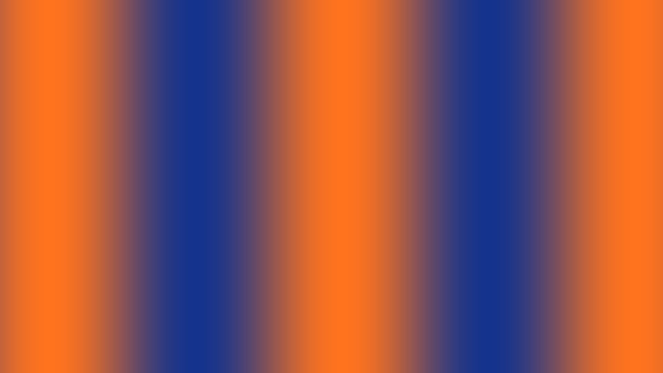

# Your first shader in 10 minutes

Create an animated blue-to-orange gradient with a speed slider, two presets, and an image you can save.



The image is a WebGL render of the tutorial source at 960 × 540, Speed 1, time 0.5 seconds, with post-processing bypassed.

**Works with:** Web and Windows Desktop, v1.5.0 and development builds. On Web, sign in and verify your email first. The steps use English UI labels.

Prefer to start with the finished project? [Download the tutorial bundle](https://raw.githubusercontent.com/wiki/antelm-dev/shadergrove/examples/first-shader.json), save it as `first-shader.json`, and import it using **Import & export**. Choose the mode that keeps both copies if a shader with the same ID already exists. The bundle includes both presets.

## 1. Create a project

Open **New shader…** from the app menu or the command palette (`Ctrl+K`). Name it **First Shader** and choose **Create**.

The new shader starts with a working template. Open the editor and inspector if they are hidden; [Workspace](Workspace) explains the panels.

## 2. Add a speed slider

In the editor, open **Config**. Replace its contents with this JSON array:

```json
[
  {
    "key": "speed",
    "type": "number",
    "label": "Speed",
    "default": 1,
    "min": 0,
    "max": 3,
    "step": 0.05
  }
]
```

A **Speed** slider appears in the inspector's **Controls** tab. Shadergrove connects the key `speed` to the GLSL uniform `u_speed`.

The old template may temporarily report missing controls while you replace its code in the next step.

## 3. Replace the Image pass

Open the **Image** document and replace its GLSL with:

```glsl
precision highp float;

uniform vec2 iResolution;
uniform float iTime;
uniform float u_speed;

varying vec2 vUv;

void main() {
  vec2 uv = vUv;
  uv.x *= iResolution.x / iResolution.y;

  float wave = 0.5 + 0.5 * sin(uv.x * 8.0 + iTime * u_speed);
  vec3 blue = vec3(0.08, 0.20, 0.55);
  vec3 orange = vec3(1.0, 0.45, 0.12);

  gl_FragColor = vec4(mix(blue, orange, wave), 1.0);
}
```

Leave the **Vertex** document as supplied by the template.

You should see vertical bands moving across the preview. Move **Speed** from `0` to `3`: zero stops this animation; larger values make it move faster. The app's Pause action freezes the clock for the whole shader.

For the plain gradient shown by this code, bypass the **Post-processing** master switch. You can turn it back on later and experiment with the effects rack.

## 4. Change one thing

Change `uv.x * 8.0` to `uv.x * 16.0`.

The bands become narrower. The shader recompiles as you edit. If the code fails to compile, the last valid preview keeps running; look at the editor diagnostics, fix the line, and continue.

Restore `8.0` if you want to match the downloadable project.

## 5. Save two presets

First, save the shader with `Ctrl+S` and wait for the saved indicator. This stores the new Config schema before you create presets against it.

Set **Speed** to `0.4`, open **Presets**, use its save action, and name the preset **Calm**.

Set **Speed** to `2` and save another preset named **Fast**. Select either preset to restore its value.

For this exercise, leave **Also capture the render settings** unchecked. That option also saves the effects chain; applying a preset that carries it changes the shader's render settings.

Use **Save shader** or `Ctrl+S` and wait for the saved indicator. Saving a parameter preset and saving your shader source are separate actions.

## 6. Keep an image and a portable project

Use **Capture image** to save a PNG of the current frame. You can pause first to choose a frame.

Use **Export shader…** to keep a portable JSON copy of the saved project, controls, presets, and assets. Save the shader before exporting so your latest source and render settings are included.

A PNG captures the appearance of one frame. The JSON bundle lets you reopen and edit the project.

## Try next

- Add a `color` control and use its `vec3 u_<key>` uniform to choose a band color.
- Add Bloom or Vignette in **Post-processing**.
- Duplicate the shader before trying a different formula.
- Follow [Plugins and integrations](Plugins-and-integrations) to work with Shadertoy or Wallpaper Engine.

If the preview is missing or saving is blocked, see [FAQ](FAQ).
