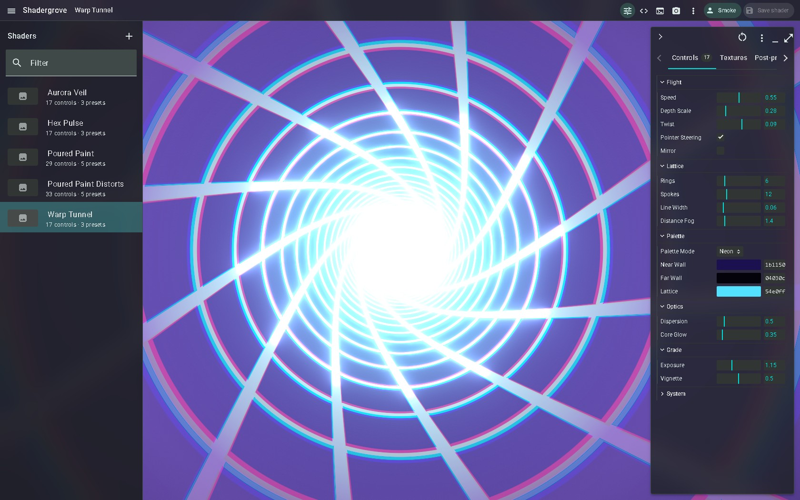

# Shadergrove user guide

Build a shader, tune it while it runs, and keep the result in your own library.

## Start here

- **[Create your first shader in 10 minutes](First-shader)** — make an animated gradient, add a speed slider, save two presets, and capture an image.
- **[See what Shadergrove can do](Features)** — browse the features and compare Web with Desktop.
- **[Find your way around the workspace](Workspace)** — editor, controls, textures, effects, presets, and shortcuts.
- **[Use plugins and integrations](Plugins-and-integrations)** — import from Shadertoy, export to Wallpaper Engine, and customize the app.
- **[Solve a problem](FAQ)** — compilation, saving, performance, account libraries, and missing commands.

## Choose where to work

**Windows Desktop** keeps your library on your computer and lets you edit offline without an account. Get the installer or portable executable from [Releases](https://github.com/antelm-dev/shadergrove/releases). Account uploads are optional and depend on the server configured into your build.

**Web** runs in your browser. Sign in to the server you use and verify your email to create or change shaders in your private account library. To run your own server, follow the [self-hosting guide](https://github.com/antelm-dev/shadergrove/blob/master/README.md#self-hosting).

## Versions covered

The core tutorial covers **v1.5.0** and the current development code. The plugins guide explicitly marks the newer official catalogue workflow as **Development**; v1.5.0 uses built-in Shadertoy and Wallpaper Engine commands. On Desktop, check **Help → About Shadergrove…** for your app version.

This guide was checked against the v1.5.0 tag and development commit [f4ad6d8](https://github.com/antelm-dev/shadergrove/commit/f4ad6d8) on **6 October 2026**. Features present in source can depend on server configuration; their presence does not verify a particular deployment.

## Go further

- [Project repository](https://github.com/antelm-dev/shadergrove)
- [Example shaders](https://github.com/antelm-dev/shadergrove/tree/master/examples/shaders)
- [MCP setup](https://github.com/antelm-dev/shadergrove/blob/master/tools/mcp/README.md)
- [Report a bug](https://github.com/antelm-dev/shadergrove/issues/new)

The workspace image shows an existing example. Follow the tutorial to create your own project.
